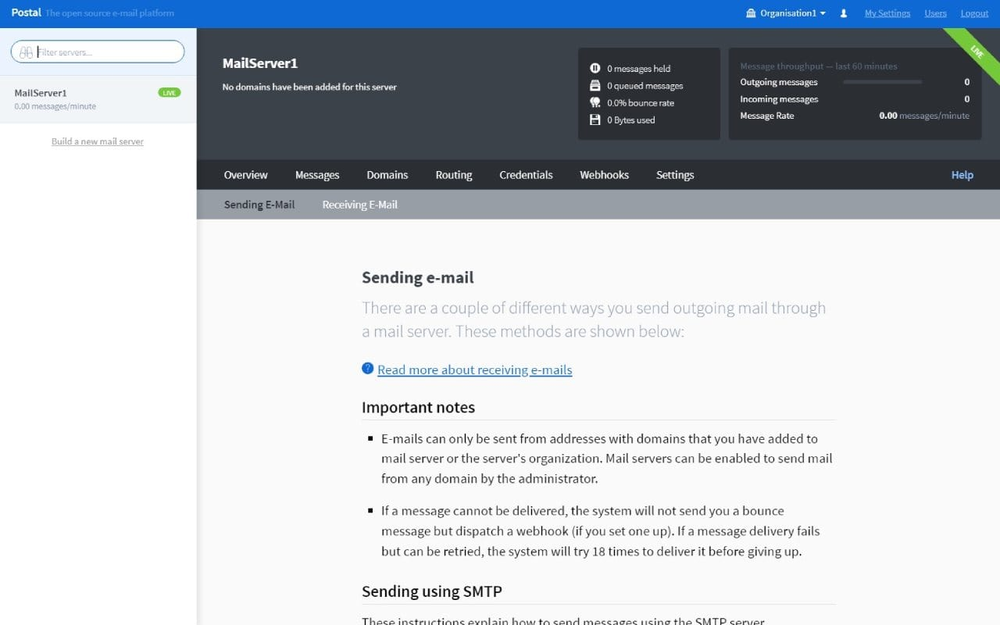

# Postal CI/CD pipeline

Deploy Postal server with CI/CD on Elestio

 
 

# Once deployed ...

You have to register with this email address: [EMAIL] to create an admin access in this URL:

    URL: https://[CI_CD_DOMAIN]
    login: "[ADMIN_EMAIL]"
    password: "[ADMIN_PASSWORD]"

You will then receive an email confirmation along with your password.
